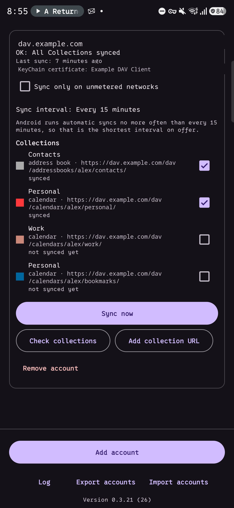
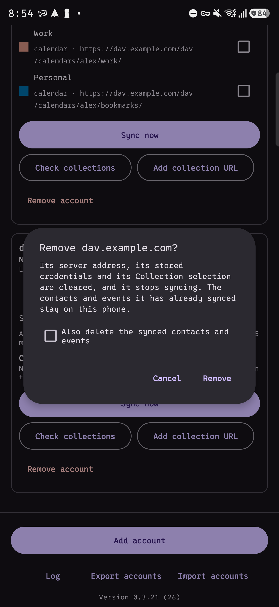
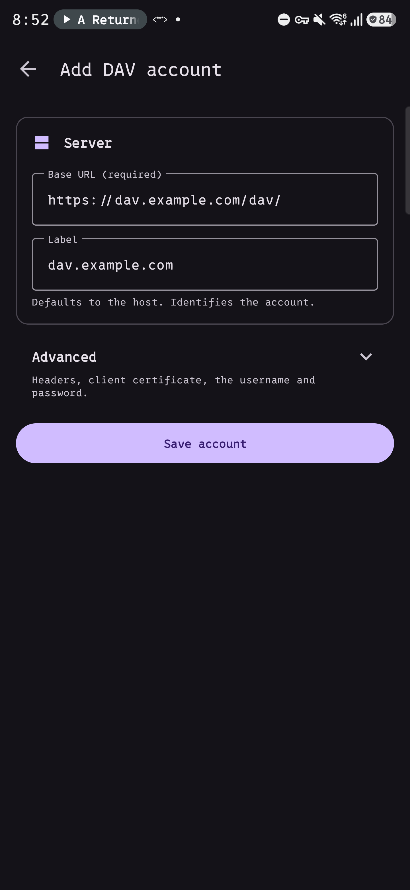
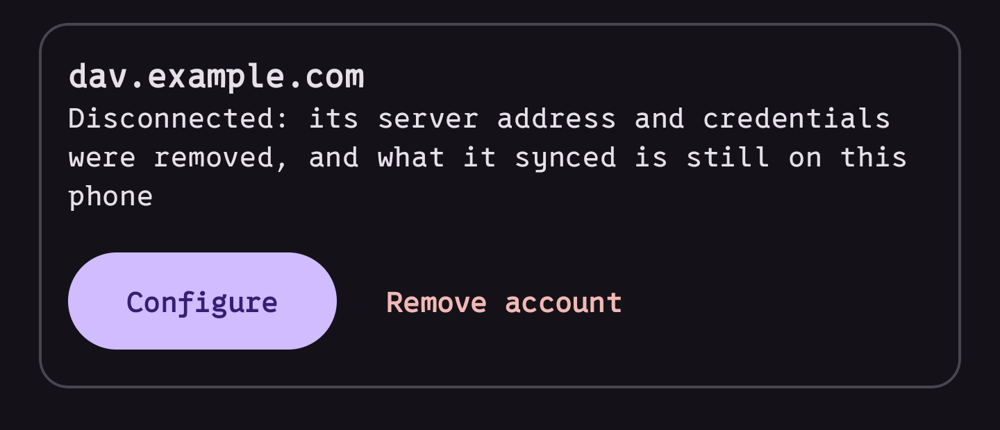

# DAVKeep

[davkeep.app](https://davkeep.app) · Android only

An Android CalDAV/CardDAV sync provider that can attach **arbitrary HTTP headers**
and/or a **client certificate** per account.

The application id is `app.davkeep`. It was `xyz.satr.davprovider` up to 0.4.4:
Android binds every synced row to the account type, so the rename ships as a
separate app rather than an update. Export the accounts from the old one, import
them into this one, then uninstall the old one.

It syncs: an account configured with only a client certificate pulled **368 contacts**
and **13 events** from a real server behind a certificate-gated proxy into the Android
providers, with no VPN and no custom headers, and a second sync wrote **0 rows**. Latest
release [0.3.21](https://github.com/t1nk333r/dav-provider-android/releases); the design
is specified in [`docs/spec/v1.md`](docs/spec/v1.md), the reference for what the code is
meant to do.

  
  

## What it does

- Custom HTTP headers on every request, per account, and client certificates from the
  KeyChain or an imported PKCS#12 archive
- Contacts and calendar through the platform sync adapter, with collection discovery,
  CTag/ETag change detection and batched multiget
- **Read-only**: the server is the source of truth; phone-side edits are not pushed
- Failures that name the HTTP status, the first line of the response body, and whether a
  certificate was offered — the last being what separates "no certificate was sent" from
  "the certificate was rejected"
- A terminal-styled log of recent runs, with search, filters and share
- Per-account scheduling, an unmetered-only mode, and a battery prompt that appears only
  with evidence of late syncs
- **Removal keeps what it synced.** The account stays, reading as Disconnected, until you
  ask for the data to go too — the rows belong to the account, so an account that goes
  takes them with it
- **Nothing overwritten by accident.** The label is the Android account name, so a form
  matching an existing account would replace its address, password, certificate and
  selection. It refuses and names the account instead

Adding one, and what removal leaves behind:

  
  

The log is in [`docs/screenshots/`](docs/screenshots), dark and light. Not built:
two-way sync, tasks, free-busy, sharing. Not settled: the acceptance criteria named 16
events and the server yielded 13; the log records rows written but not resources read, so
the difference cannot be diagnosed from the app alone.

## Why

Mainstream Android DAV clients cannot send arbitrary request headers, which makes a DAV
server behind an identity-aware proxy — Cloudflare Access with service tokens expects
`CF-Access-Client-Id` / `CF-Access-Client-Secret` — unreachable from Android without
putting the server on the open internet or running a system-wide VPN. Client certificate
setups are possible but fail opaquely.

This project aims at that gap only, not at replacing a DAV client generally.

## Shape

A sync adapter writing into the platform providers, so existing calendar and contacts
apps see the data unchanged: `ContactsContract` for contacts, one account per address
book, and `CalendarContract` for events.

**Must have** — custom headers on every request (`PROPFIND`, `REPORT`, `PUT`, `DELETE`,
`OPTIONS`); a certificate from the KeyChain, with or without password auth; basic auth
alongside either; an explicit base URL, with optional `.well-known` discovery from a
given root; and failures naming the status, the body's first line and whether a
certificate was offered.

**Not doing** — VTODO, a web UI or server component, CalDAV scheduling, free-busy,
sharing or ACLs.

## Approach

A standalone app rather than a fork, which would mean tracking upstream forever. The
protocol layer is [`dav4jvm`](https://github.com/bitfireAT/dav4jvm), which supplies
request construction and XML parsing but **no sync algorithm**: the engine, the change
detection and the provider writes are this project's own.

The question this repo was built to answer — whether an identity-aware proxy honours
service-token headers on `PROPFIND` and `REPORT`, not just the methods it recognises — is
**settled: yes**. A wrong token is redirected to the proxy's login page, so the passes are
attributable to the credential rather than to the proxy ignoring unfamiliar methods.

## Repo conventions

Agent/tooling conventions live in [`AGENTS.md`](./AGENTS.md) and `docs/agents/`.

## Licence

GPL-3.0-or-later. See [LICENSE](LICENSE).

The app talks only to the servers you configure: no analytics, no ads, no
update check, no network use that you did not ask for.
