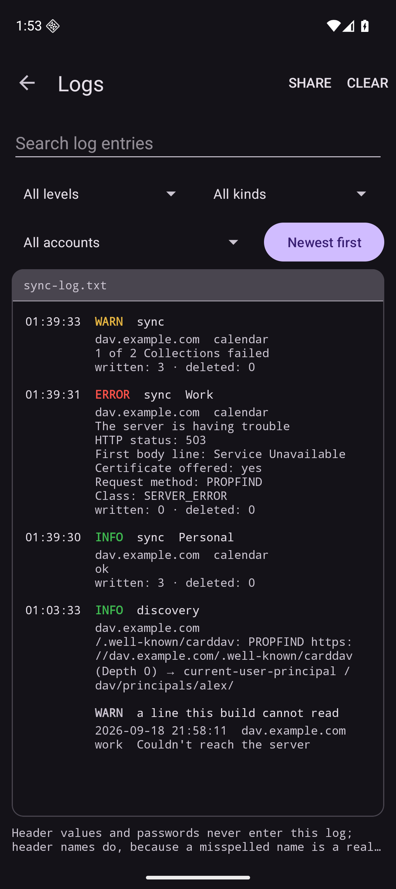

# dav-provider-android

An Android CalDAV/CardDAV sync provider that can attach **arbitrary HTTP headers**
and/or a **client certificate** per account.

Status: **working prototype.** It syncs. An account configured with only a client
certificate pulled **368 contacts** and **13 events** from a real CalDAV/CardDAV
server behind a certificate-gated proxy into the Android providers, with no VPN and
no custom headers. A second sync wrote **0 rows**, so repeat runs update rather than
duplicate.

The design is specified in [`docs/spec/v1.md`](docs/spec/v1.md); that document is
the reference for what the code is meant to do. What is built:

- Per-account custom HTTP headers on every request, and client certificates from
  either the Android KeyChain or an imported PKCS#12 archive
- Contacts and calendar sync through the platform sync adapter, with collection
  discovery, CTag/ETag change detection and batched multiget
- **Read-only**: the server is the source of truth; phone-side edits are not pushed
- An error taxonomy that names what actually failed — the HTTP status, the first
  line of the response body, and whether a client certificate was offered — rather
  than reporting every failure as "no DAV services found"
- A terminal-styled log of recent runs, with search, filters and share
- Scheduling per account, including an unmetered-only mode, and a battery-optimisation
  prompt that appears only with evidence — it reports that syncs have been running late
  and leaves the conclusion to you rather than claiming to know why

Not yet settled: the acceptance criteria name 16 events and the server yielded 13,
so either the estimate was approximate or a few components did not survive the
mapping. The log records rows written but not resources read, which is why the
difference cannot be diagnosed from the app alone.

Two-way sync, tasks and scheduling beyond a fixed interval are out of scope, with
reasons recorded on the issues.

  
  

The log names what failed rather than that something did: an HTTP status, the first
line of the response body, and whether a certificate was offered — the last of which
is the fact that separates "no certificate was sent" from "the certificate was not
accepted". The dark and light variants are in [`docs/screenshots/`](docs/screenshots).

## Why

Mainstream Android DAV clients cannot send arbitrary request headers. That makes a
DAV server sitting behind an identity-aware proxy (for example Cloudflare Access with
service tokens, which expects `CF-Access-Client-Id` / `CF-Access-Client-Secret`)
unreachable from Android without either putting the server on the open internet or
running a system-wide VPN. Client-certificate (mTLS) setups are possible today but
fail opaquely, with no way to tell "no certificate was offered" from "the certificate
was rejected".

This project aims at that narrow gap only. It is not an attempt to replace any
existing DAV client generally.

## Shape

A sync adapter that writes into the platform providers, so existing calendar and
contacts apps see the data with no changes:

- `ContactsContract` — contacts, one account per address book
- `CalendarContract` — events

### Must have

1. Per-account custom HTTP headers, sent on every request (`PROPFIND`, `REPORT`,
   `PUT`, `DELETE`, `OPTIONS`)
2. Client certificate selected from the Android KeyChain, usable with or without
   password auth
3. Basic auth alongside either of the above
4. Manual configuration — explicit base URL, no email-based discovery guessing;
   optional `.well-known` / `current-user-principal` discovery from a given root
5. Honest error surfacing: the actual HTTP status, the first line of the response
   body, and whether a client certificate was offered

### Non-goals

- No task sync (no VTODO)
- No web UI, no server component
- No CalDAV scheduling, free-busy, sharing or ACL management

## Approach

A standalone app, not a fork or patch of an existing client — a fork means tracking
upstream forever. The protocol layer comes from
[`dav4jvm`](https://github.com/bitfireAT/dav4jvm), which supplies request construction
and XML parsing but **no sync algorithm**; the engine, the change detection and the
provider writes are this project's own.

The open question this repo was built to answer — whether an identity-aware proxy
honours service-token headers on `PROPFIND` and `REPORT`, not just on the methods it
recognises — is **settled: yes**. A service token authorises `PROPFIND`, `REPORT`,
`PUT`, `DELETE` and `OPTIONS`, while a deliberately wrong token is redirected to the
proxy's login page, so the passes are attributable to the credential rather than to
the proxy ignoring unfamiliar methods.

## Repo conventions

Agent/tooling conventions live in [`AGENTS.md`](./AGENTS.md) and `docs/agents/`.
